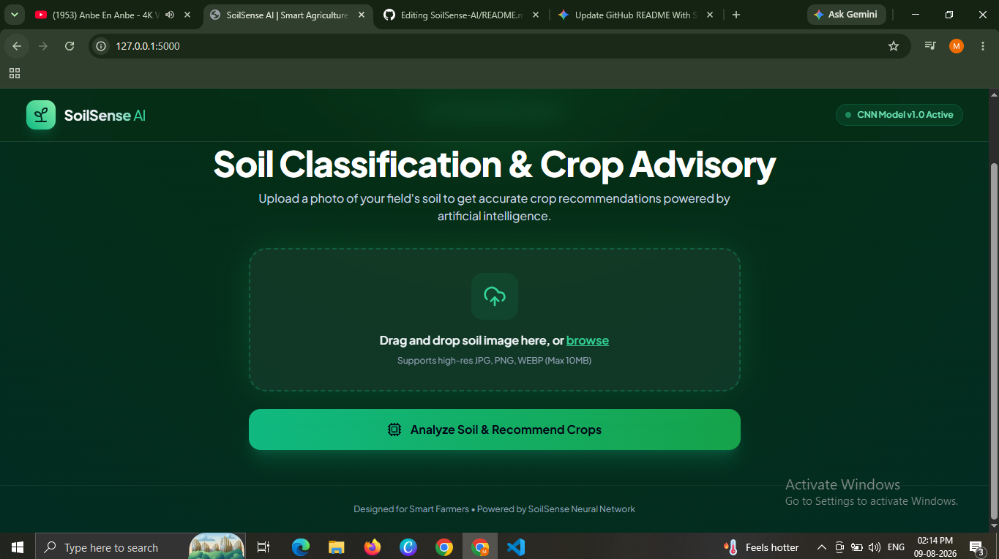
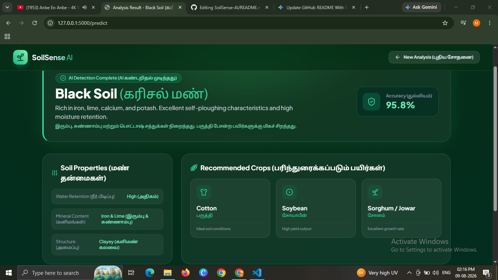
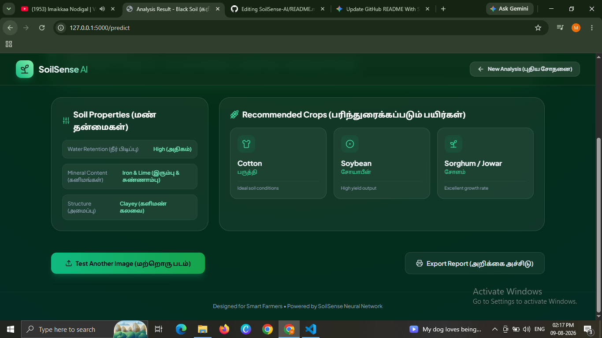
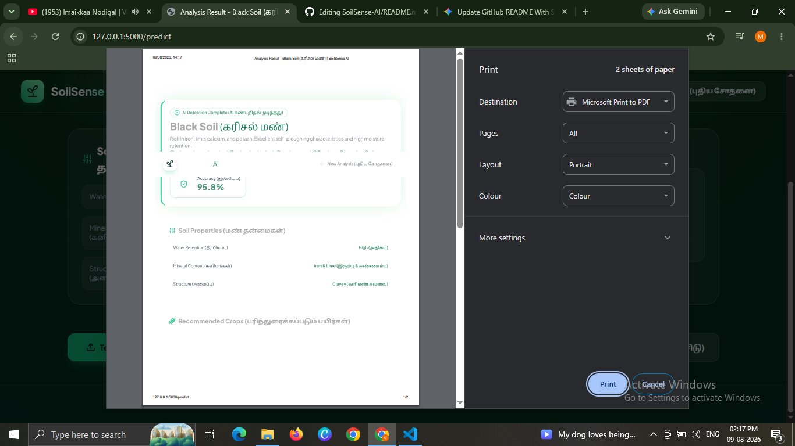
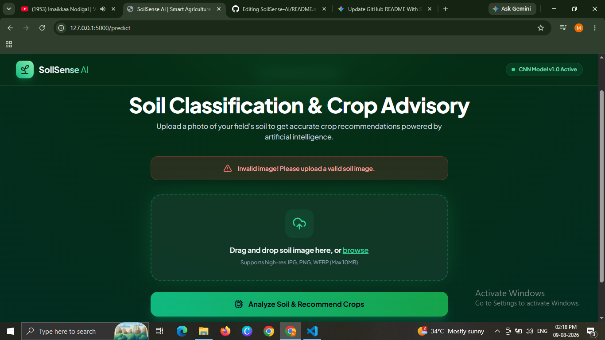

# Soil-Type-Classification for Crops Suggestion 🌳🌲🎄🎋🌴

## Model deployed as Web-Application API at: 🎯🔗📳  
[https://soilnet.herokuapp.com/](https://soilnet.herokuapp.com/)

## Code Notebook at Kaggle: 📝📒📔📑🧾💻  
[https://www.kaggle.com/omkargurav/soil-type-classification-soilnet](https://www.kaggle.com/omkargurav/soil-type-classification-soilnet)

## Dataset available at: 📚📓🗞💾  
[https://www.kaggle.com/omkargurav/soil-classification-image-data](https://www.kaggle.com/omkargurav/soil-classification-image-data)

---

### Overview
For this project, a deep learning model is trained with images across four different types of soil: **Alluvial**, **Black**, **Clay**, and **Red**. 

Based on the classified type of soil, suitable crop suggestions are provided to help optimize crop yields.

---

## Screenshots: 🖥🖨✔🖼📷  

